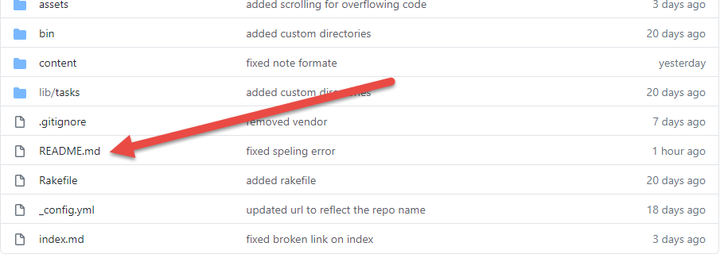
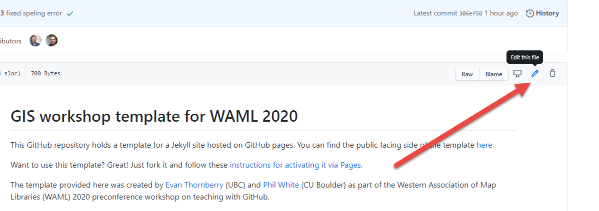
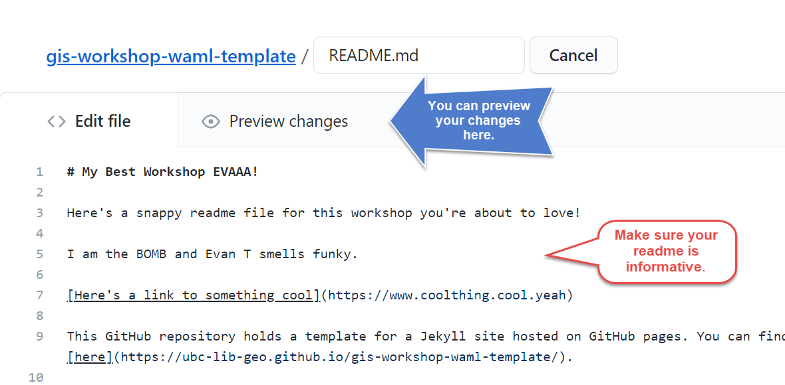
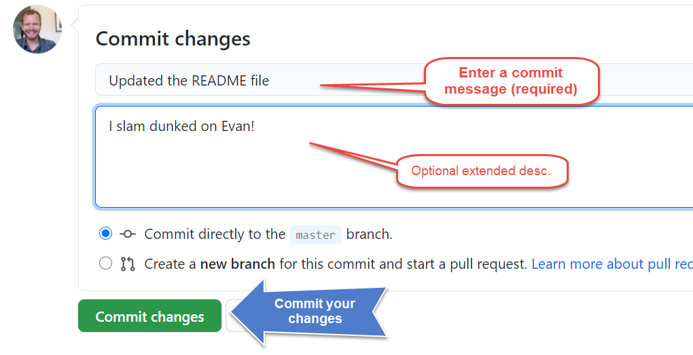
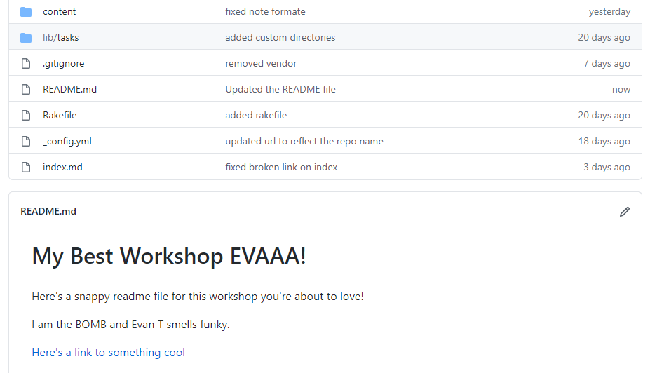

# Edit Your README
First we're going to make a few quick edits to your new repository's README file.  

### *1*{: .circle .circle-blue} In your repository, double-click on `README.md`.  

  

This will open up a page that just shows your `README.md` file.

### *2*{: .circle .circle-blue} Now double click the pencil icon to edit this markdown file.  

    

Now you will see simple editing interface.

### *3*{: .circle .circle-blue} Make some edits to your `README.md` file.  
This is easy, just start typing in this editing window.

### *4*{: .circle .circle-blue} When you're done editing, scroll down and enter a commit   message, then click `Commit changes`.  

### All done! Now head back to your repo's home page to view the updated `README`.  

