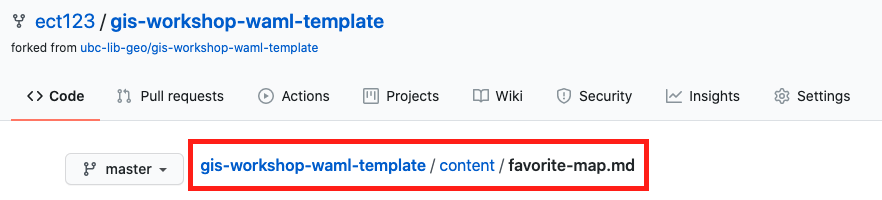
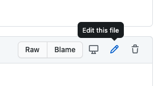

# Insert an Image

You'll no doubt want to at some point add an image to any site you make. Let's add an image to our new page to see how it works.

The basic Markdown syntax for adding an image is:

``

**Alt text** briefly describes your image, and impacts your site's accessibility a search-ability. Always add short alt-text descriptions to your images.

Your **image path or URL** must be included as well. If you're using a, URL it must be to the image file endpoint.

Since we already have an image file we want to use in our `content/img` folder, let's go ahead and add it using a relative path.

### *1*{: .circle .circle-blue} Determine your relative path
You should see the path to your new page `favorite-map.md` at the top of your page, which looks something like this:

We want to add an image on this page showing a map. The image file for that map is in our `content/img/` folder. The path to that file is:     

`gis-workshop-waml-template/content/img/fav-map.png`    

The relative path from our `.md` page file to the `.png` image is:
`img/fav-map.png`

This is like saying *the `fav-map.png` file is located in the `img` folder, in the current folder*

### *2*{: .circle .circle-blue} Add your link
Edit your `fav-map.md` file by clicking on the edit file button:

In the text area **below** your front matter, paste the following link text:

``

### *2*{: .circle .circle-blue} Commit your changes
Step 1
{: .label .label-step}
Add a short message like "added an image"
{: .step}
Step 2
{: .label .label-step}
Click on the green "commit changes button.
{: .step}

Now, count to 30, then refresh your browser to see the changes to your site.
