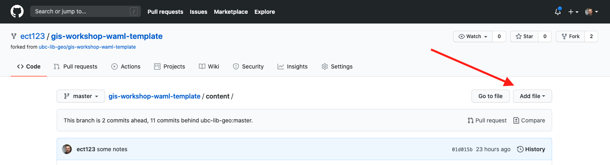
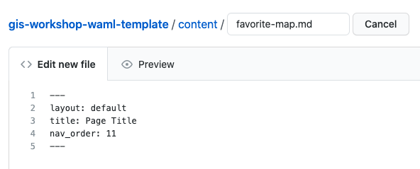
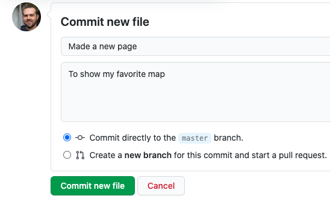

# Add a New Page

Now that you have your workshop repository live and ready to edit, you might want to add a new page. GitHub.com allows us to add a new file.

### *1*{: .circle .circle-blue} Nagivate to your `content` folder
Just click on the title of the folder in GitHub. That will take you to a new page where you can see all of the content that makes up the site.

We created this folder to store all of our pages, images, data, etc. – our own preference for keeping things relatively tidy. But a side-effect of additional folder levels is that it elongates the URL of pages inside them.
{: .note}

### *2*{: .circle .circle-blue} Add a file to this folder
You can add files by clicking the **Add file** button, and selecting **Create new file** from the dropdown.



### *3*{: .circle .circle-blue} Make a new Markdown file
We can add any type of text-based file we want, but since our goal here is to create a new page for our site, let's make it a Markdown file.

Step 1
{: .label .label-step}
Name your new file
{: .step}
Name your file `favorite-map.md`


Step 2
{: .label .label-step}
Add your Front Matter
{: .step}
[Front Matter](https://jekyllrb.com/docs/front-matter/) is needed to convert this file to a new web page. It's used by Jekyll to add style and other settings to your page. We'll get to front matter more later...

Add this to the body of the file, using lines 1 to 5:
```
---
layout: default
title: Your New Page's Title
nav_order: 11
---
```
You should have something that looks like this:



### *4*{: .circle .circle-blue} Commit your new file
Now we'll add a new "commit" the new file – this is Git for adding a description of the changes you made, then saving to the repository.

You should always be as concise and descriptive as possible when adding a commit message. It's very easy to add inadequate commit messages, like "added some content" or "made a small change", but it's good practice to make commit messages meaningful. However, adding a file is pretty simple, so for this exercise add a commit message that is something like:



Then, press the green button to commit your file!
