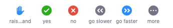

# Participating online
Active participation enlivens the session with other voices and perspectives. We encourage you to engage with instructors and with each other.    

Microphones are muted by default to improve audio quality and recording is disabled to preserve participant privacy.    

The Zoom toolbar provides several ways to be part of the conversation:

## Participants window
The _Participants_ window lists everyone in the session. Click the icons at the bottom of the window to communicate with the instructors.

Clicking an icon makes it appear next to your name in the participants list. Use this to **answer yes/no** questions or to **raise your hand** when instructors invite you to ask a question, comment, or share your screen.

## Chat window
Use the _Chat_ window to comment or ask a question at any time. Instructors will do their best to respond, sometimes waiting for a break in the lesson to do so.

The _Chat_ window is a good place to report problems with your audio connection. Instructors may also use it to share links to material mentioned in the session.

## Share your screen
In some cases instructors may invite you to share your screen. Raise your hand to indicate that you're ready to share. When called upon click _Share screen_, select a window to display, and click _Share_.

## Contribute to the Whiteboard
The _Whiteboard_ is a collaborative space that everyone can annotate with drawings and text. When the whiteboard is shared click _View options_ and select _Annotate_.

This opens the annotation toolbar. Drawings and text you add to the screen will be visible to everyone in the session or breakout room.

